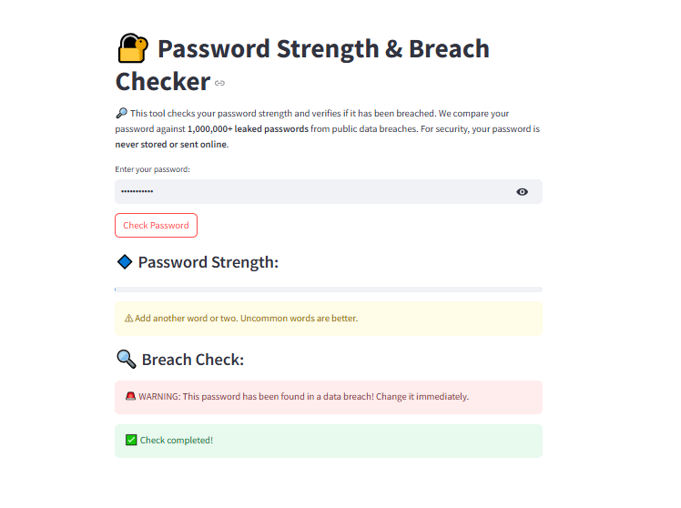

# 🔐 Password Strength & Breach Checker

A Streamlit application that evaluates password security by checking strength metrics and comparing against a database of known breached passwords.




## 🌟 Features

- **Password Strength Analysis**: Uses the zxcvbn library to evaluate password quality based on multiple factors
- **Breach Database Check**: Compares passwords against 1,000,000+ previously leaked passwords 
- **Local Security**: All processing happens locally - passwords are never stored or transmitted
- **Visual Feedback**: Clear strength indicators and helpful improvement suggestions
- **Efficient Processing**: Bloom filter implementation for fast, memory-efficient breach checks

## 📋 Requirements

- Python 3.8+
- Streamlit
- zxcvbn
- bloom-filter2

## 🚀 Installation

1. Clone this repository:
   ```bash
   git clone https://github.com/abdul-ahad-26/password-checker.git
   cd password-checker
   ```

2. Create and activate a virtual environment:
   ```bash
   # Using uv (recommended)
   uv venv
   source .venv/bin/activate  # On Windows: .venv\Scripts\activate
   
   # Or using venv
   python -m venv venv
   source venv/bin/activate  # On Windows: venv\Scripts\activate
   ```

3. Install dependencies:
   ```bash
   # Using uv
   uv pip install -r requirements.txt
   
   # Or using pip
   pip install -r requirements.txt
   ```

4. Download the breach database file:
   ```bash
   # Example command - replace with actual source
   wget https://example.com/breached-passwords.txt
   ```

## 💻 Usage

1. Run the Streamlit application:
   ```bash
   streamlit run app.py
   ```

2. Open your browser to the URL provided by Streamlit (typically http://localhost:8501)

3. Enter a password to check its strength and breach status

## 🧠 How It Works

### Password Strength Analysis
The application uses Dropbox's zxcvbn library to evaluate password strength based on:
- Length and complexity
- Use of common patterns and sequences
- Presence of dictionary words
- Known password strategies

### Breach Detection
The application uses a Bloom filter data structure to efficiently check if a password appears in a dataset of previously leaked passwords:
- Space-efficient probabilistic data structure
- One-way hashing for security
- No false negatives (will never miss a breached password)
- Very low false positive rate (configured at 1%)

## 🔄 Future Improvements

- [ ] Add export functionality for password feedback
- [ ] Implement password generation suggestions
- [ ] Add HIBP (Have I Been Pwned) API integration
- [ ] Create detailed reports for enterprise users
- [ ] Add multilingual support

## 🔒 Privacy & Security

This application prioritizes security in several ways:
- Passwords are processed entirely in your browser
- No data is sent to external servers or stored permanently
- The breach database contains only the minimal information needed for checks
- No logging or analytics collected on password inputs

## 📜 License

This project is licensed under the MIT License - see the LICENSE file for details.

## 🙏 Acknowledgements

- [Streamlit](https://streamlit.io/) for the web application framework
- [zxcvbn](https://github.com/dropbox/zxcvbn) by Dropbox for password strength evaluation
- [bloom-filter2](https://github.com/remram44/python-bloom-filter) for efficient set membership testing